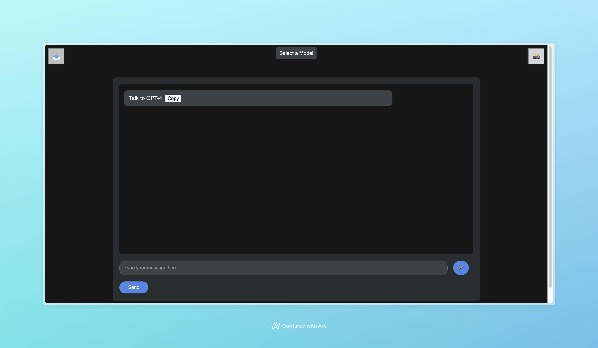

# GPT-4 ChatBot Portal for Assistants API

Welcome to my **Chat-Bot Portal**, a full-featured *Node.js*-based web application that allows users to interact with a chatbot powered by *OpenAI*'s **GPT-4 Assistants API**, including the latest *Python*, *Hearing*, and *Speaking* capabilities with *image-generation* and superior *Model Performance*. Now includes a *native* **Code Environment** and *stateful* **Assistant Conversations**!

## Table of Contents

- [Features](#features)
- [Examples](#examples)
- [Structure](#structure)
- [Prerequisites](#prerequisites)
- [Installation](#installation)
- [Usage](#usage)
- [Advanced](#advanced-use)
- [Author Notes](#author-notes)
- [Further Explanations](#further-explanations)
- [Basic Guide](#guide-basic-setup--use)
- [Relevant Links](#relevant-links)
- [Author Links](#author-links--custom-gpts)
- [Research Papers](#research-papers)
- [FAQ](#faq)
- [Glossary](#glossary)
- [Updates](#updates)
- [Tokens](#token-costs-explained)
- [TODOs](#todos)
- [Quick-Start](#quick-start-guide)
- [Docker](#docker)
- [Contributions](#contributions)
- [License](#license)

## Features

- Interactive **chat interface** with support for *text messages*.
- **Voice Conversations** via *Whisper* transcriptions and *spoken responses*.
- Server-side integration with *OpenAI* **Assistants API**.
- **File-Upload** to *Custom Agents*.
- **Basic authentication** for *secure access*.
- Customizable *System-Defined Instructions* and *Assistants*.
- Simple and intuitive **UI** with *copy-to-clipboard* feature.
- **Markdown** *rendering* for chat messages in *Marked* styles.
- **Export** as *HTML* **button** for *conversation history*.
- Integrated **Python** *environment* with "**Code Interpreter!**"
- **Image Generation** with *DALL·E 3* at "**Generate:**".
- **Model Selector** of various *OpenAI APIs*. Includes:
  - **GPT-4**: Default – Snapshot of the *Most Intelligent* Version
  - **GPT-4-Turbo**: Currently used in *ChatGPT Plus*
    - *Maximum Token Window*: **128,000**!
  - **GPT-3.5-Turbo**: *Cheapest* Model

## Examples

### Demo

- **TODO**: Include Video Demo

### Interface



## Structure

- **portal.html**: The main HTML file for user interaction. It includes the chat interface layout, a message input area, an image upload and export button for history, voice chat functionality, a model selector, and it links to the `script.js` file.
- **script.js**: Contains client-side logic for handling user inputs, sending messages and images to the server, and displaying marked responses in the chat interface. It also includes file selection for uploads and a copy-to-clipboard function with support for exporting your current conversation history and changing models. Lastly, it handles voice conversations & text box formatting.
- **server.js**: The server-side Node.js file using Express.js. It processes POST requests to `/assistant` and interacts with the OpenAI Assistants API, along with Whisper and TTS, and manages CORS, Multer, basic authentication, and static file serving. Lastly, it handles Assistant and Thread management along with image generation, while hosting custom instructions.
- **instructions.md**: The model's System and Custom Instructions, customized for optimal responses & contextual prompt enhancement. These can be modified by the user to include background profiles.
- **.env**: The *Environment Variable* file for your *sensitive passwords*. Must be modeled after the `.env.example` template.
- **chat.css**: The *stylesheet* for the portal's *look* and *formatting*.

## Prerequisites

- **Node.js** installed on your machine from [**nodejs.org**](https://nodejs.org/).
  - Specifically, the download link for various devices can be seen [**here**](https://nodejs.org/en/download).
- [*Optional*] **Git** or **GitHub Desktop** to clone the repository.
  - You can also simply download the repo as a `.zip` file and place it elsewhere.
- An OpenAI **API** key for accessing *GPT-4*. Billing Credit may be needed.
  - See [**here**](https://platform.openai.com/api-keys) to *create your key*.

## Installation

1. **Clone the Repository**:
   - Use *Git* to clone the repository to your local machine:

     ```sh
     git clone -b assistants https://github.com/Zaki-1052/GPTPortal.git
     ```

2. **Navigate to the Project Directory**:
   - Change into the project's directory:

     ```sh
     cd GPTPortal
     ```

3. **Install Dependencies**:
   - Install the required Node.js packages:

     ```sh
     npm install
     ```

4. **Set Up Environment Variables**:
   - Create a `.env` file in the root directory.
     - Format shown in `.env.example`
     - Can specify `ASSISTANT_ID` and `THREAD_ID`.
   - Add your OpenAI API key and basic authentication:

     ```env
      OPENAI_API_KEY=your_api_key_here
      USER_USERNAME=Username
      USER_PASSWORD=Password      
     ```

5. **Start the Server**:
   - Launch the server with Node.js:

     ```sh
     node server.js
     ```

6. **Access the Chat Interface**:
   - Open a web browser and go to `http://localhost:3000/portal`.
     - *Portal URL*:
  
     ```sh
     http://localhost:3000/portal
     ```

## Usage

- **Sending a Message**:
  - Type your message in the text box.
  - Press Enter or click the Send button to submit.
- **Starting a Voice Conversation**:
  - Click the 🎤 microphone icon to activate *voice input*.
  - Speak your query or message, and toggle the button to end recording.
  - It will be processed by the *Whisper API* and seen in the input box.
  - The model's response will be read back to you through a *text-to-speech API*.
- **Uploading a File**:
  - Click the 📤 button to open the *file selector*.
  - Choose a file. It will be sent with your next message.
- **Model Selector**:
  - Click on the "*Select a Model*" button at the top.
  - Hover your cursor over the options to view *descriptions*.
  - Choose your preference based on current use-case.
    - If no Model is chosen, the Portal will *Default* to *GPT-4-Turbo*.
- **Exporting Conversation**
  - Click the 📤 to export the *Conversation History*.
    - It will be an *HTML* document formatted in *Markdown*.
- This will *end the conversation* and *kill the server*.
- **Image Generation**: *IMPORTANT!*
  - Specific *Syntax* is needed to activate *DALL·E 3*:
    - Type: "**Generate:**" followed by your prompt.
      - The API will *produce the image* in the chat window, subsequently *download* it, and *end* the chat.
        - Only *one image* can be generated per server *session*.
        - **Cost**: *$0.080 / image*

### Advanced Use

- **Specify Assistants**:
  - Go to the [*OpenAI Assistants Dashboard*](https://platform.openai.com/assistants).
  - Create or choose an existing Assistant.
  - Copy the ID into the `.env` file.
  - Example:

```env
ASSISTANT_ID=asst_D3yVjKPahWhzCdZIy525nh8D
```

- **Specify Threads**:
  - After using an Assistant through the portal, find the [Conversation Thread ID](https://platform.openai.com/threads).
  - Select the Thread ID you'd like to continue, and copy into your `.env` file.
  - Example:

```env
THREAD_ID=thread_0LhmZXMUOljwx8jojB2dcMyU
```

- **Base Functionality**
  - Without any specification, your first message will create a **Custom Assistant** and start a **Conversation Thread**.
    - These will both be stored on OpenAI's servers.
  - You can continue the conversation with this assistant throughout the server instance, and **export** your *conversation* to end it.
  - You may pick up where you left off by specifying their IDs in the `.env` file.
  - Otherwise, your **Assistant** will take the qualities of the *System Prompt*, uploaded *files*, and run *Code Interpreter* natively.
  - Ask the AI to use its Python, ADA, or Code Interpreter tools to write and execute code, read your files, and more!
  - The **Assistants API** uses the same backend as *ChatGPT-Plus*, but you only pay for what you actually use.

## Author Notes

>**TODO**: *Explain Assistants API!*

- **Smartest Snapshot of ChatGPT**: This application uses the GPT-4-Turbo model, previewed in ChatGPT-Plus.
  - This model was released on *January 25, 2024* via **API** in order to address the **laziness** *problem*.
  - Always keep track of your token usage (relevant link found below), and adjust instructions and/or parameters when needed.
- **Voice Chat**: Calls to OpenAI's proprietary *multi-modal APIs* via your key; be sure to keep an eye on your *expenses*.
- **Billing for API Use**: A $5 deposit is required to access the *paid tier* of the OpenAI API. See OpenAI *Documentation* for billing setup.
- **System Prompt**: Found in `instructions.md`. Modify user profile and instructions as needed. 
  - You can completely rewrite them for your desired 
- For *security reasons*, this *web portal* requires the user to do some work of their own: *installing* the necessary dependencies and packages, adding their own *environment variables* like *API Key* and *HTTP Auth Credentials* (you can simply make these up) in a `.env` file, and manually running the *server* in your terminal.
  - Be assured that this repo is incapable of grabbing any information from the User, including their Key, but they should still be careful when experimenting with *Pull Requests*, regardless of the `.gitignore` file in the root of this repository.
  - Unlike the **Chat Completions API** on *Main*, *OpenAI* stores a copy of your *conversations* with **Assistants** on their servers.
  - This *functionality* is currently in **Beta**.

### Further Explanations

The *OpenAI* **Assistants API**, or *Application Programming Interface*, utilizes a proprietary backend to accomplish the following:

1. **Initializes** a new **Assistant** upon the first message received or the **upload** of a *new file*.
2. *Receives* the **Model ID**, the **System Message**, and starts a **Python environment** in a *Jupyter Notebook*.
3. It then either *finds* or *creates* a *new* **conversation thread**, and *starts* a new "**run**".
4. **Appends** a new **message** to the *thread* and waits to **retrieve** a *run response*.
5. **Displays** the *response* from the *Assistant* and *queues* a **new run**.
6. **Lists** the **message history** in the *thread* for the *assistant* to *reply to*.

You'll need to monitor your usage of the more expensive but intelligent **GPT-4** model, which will cost just over *10-20 Cents* per session, and needs you to add *Five Dollars* in credit to be able to use your **API Key**. Be aware that at *base usage* of this web application, you will likely spend about 3-5 cents per short conversation, depending on which model you use.

Model behavior will be primarily influenced by whatever *context* is first provided to the *API* in its **instructions**; it lacks a severe filter compared to ChatGPT with increased **steerability**, but is more *expensive* than the regular Chat Interface and will *restrict* you from sending messages once you are **rate-limited**.

- Consult the provided links and **documentation** for more guidance on *Setup* and *Prompting*.
- Users are encouraged to modify the **System Prompt** in `instructions.md`, which can be found in the `public` directory.
- More information will be added about *Model Behavior* and *API Usage* to the **ReadMe** in the future.

**IMPORTANT Note** : For the **Voice Functionality** *Feature*, due to *WebKit's*'s lack of codec support and firewalling, *Whisper* and *TTS* will **NOT** work on the **Safari** *Browser*; you will need to switch to Chrome (or any other Chromium fork, including Edge, Opera, Brave, etc.) or Firefox if you want to use the *Voice Chat*.

If you'd like to add Apple-Support to *MediaRecording* via *JavaScript* feel free to install the [RecordRTC](https://github.com/muaz-khan/RecordRTC) GitHub repo and fork this project, as according to *Stack Overflow* and *Apple Community*, that should fix the issue, but I don't want this repository to get bloated.

- If you know of a better way, feel free to submit a **Pull Request**!
- The Relevant *Stack Overflow* Links are in this [*Arc Folder*](https://arc.net/space/04350A44-1A64-49DD-8196-FEA54DF31BDF).

### Guide: Basic Setup & Use

#### 1. **Understanding the Basics**

- **GitHub**: A platform for *hosting and sharing code*. Think of it as a library of code projects.
- **Node.js**: An *open-source*, cross-platform *JavaScript* runtime environment. It's the *engine* that will run the chatbot on your computer.
- **API Key**: A *unique identifier* used to authenticate requests to OpenAI's services.

#### 2. **Setting Up the Environment**

- **Create a GitHub Account**: Visit [GitHub](https://github.com/) and sign up for an account.
- **Install Git**: Download Git from [git-scm.com](https://git-scm.com/).
  - *Git* is a tool that allows you to download and manage code from GitHub.
- **Install Node.js**: Download and install Node.js from [nodejs.org](https://nodejs.org/). This will also install **npm** (*Node Package Manager*), which is used to manage JavaScript packages.

#### 3. **Cloning the Repository**

- **Clone via Git**:
  - On a Mac, open '*Terminal*'; on *Windows*, open '*Command Prompt*'. These programs allow you to interact with your computer using text commands.
  - Type `git clone -b assistants https://github.com/Zaki-1052/GPTPortal.git` and press Enter. This command copies this branch of the ChatBot Portal code from GitHub to your computer.
- **Navigate to the Directory**:
  - In the same window, type `cd GPTPortal` and press Enter. This moves you into the folder where the ChatBot Portal code is stored.
    - Be aware that in order to run the server for this repo, you will need to be in the root directory in your terminal. This means that if you rename and place it elsewhere (your Desktop, for example), you will need to `cd ~/Desktop/GPTPortal`, and use its new name before running.

#### 4. **Setting Up the ChatBot Portal**

- **Install Dependencies**:
  - Still in Terminal or Command Prompt, ensure you're in the `GPTPortal` directory. Now, type `npm install` and press Enter. This installs additional code packages that the ChatBot Portal needs to function.
- **Configuration**:
  - Find the `.env.example` file in the `GPTPortal` folder. Rename it to `.env`. This is where you'll put sensitive settings, like your OpenAI key.
    - If you do not have a text editor like VSCode, use `CMD`+`SHIFT`+`.` to reveal the hidden files in `GPTPortal`, and select the file, renaming and editing it by double clicking and using the default installed *TextEdit* or *Notepad*.
  - Open this `.env` file in a text editor and follow the format shown in the file to fill in your **OpenAI API Key** and **Login Credentials** (*Username and Password*).
  - Be sure to fill out the **HTTP Authentication** shown in the environment example as well, where you can simply make up your credentials for signing into the port. This information cannot be accessed over the internet and runs locally on your machine.

#### 5. **Obtaining an OpenAI API Key**

- **Sign Up for OpenAI**:
  - Visit [OpenAI's Website](https://openai.com/) and create an account.
  - You may need to *Verify Your Phone Number* to create your **API Key**.
- **API Key Generation**:
  - Once you're logged in, find the API section (linked below in *Relevant Links*) and generate a new API key. This key is like a password that lets your ChatBot Portal access OpenAI's features.
  - You may need to *Buy Credits* from your [**Billing**](https://platform.openai.com/account/billing/overview) page.
  - Create a new *secret key* from [**here**](https://platform.openai.com/api-keys).
    - If your account is new, you will receive **5 Dollars** in **free** *billing credit* to use towards the **API**.
    - In this case, you can simply **verify** your account and **Generate** the key.
    - *Any free credits granted may expire after some time.*
- **Insert API Key**:
  - Copy the generated API key and paste it into your `.env` file in the place of `your_api_key_here`.
    - Never share your key with anyone. This is what is used to pay for the API. Their billing system is explained in the Relevant Links, but basically, you pay out of your API Credit Balance for what you actually use, and it carries over from month to month. Refer to your personal usage page for more information. Your API is private and cannot be accessed by anyone online.

#### 6. **Running the ChatBot Portal**

- **Start the Application**:
  - Go back to *Terminal* or *Command Prompt*. Make sure you're in the `GPTPortal` directory and type `node server.js`, then press Enter. This starts the ChatBot Portal on your computer.
- **Accessing the Portal**:
  - Open a web browser and type `http://localhost:3000/portal` in the address bar. Press Enter to access the ChatBot Portal.
    - You will need to sign in with the "**Username**" and "**Password**" that you chose. If you simply copied or renamed the example template, the default settings are eponymously named.

#### 7. **Basic Troubleshooting**

- **Common Issues**:
  - If the ChatBot doesn't start, check if you missed any steps like installing Node.js, running `npm install`, or correctly entering your API Key(s) or login credentials in the `.env` file.
- **Consult README**:
  - The README file in the `GPTPortal` directory has more detailed instructions and troubleshooting tips. Refer to it if you encounter issues or need more information.

## Relevant [Links](https://arc.net/folder/B777A318-2A95-4C36-86AA-156166895CC2)

- [Pricing](https://openai.com/pricing) - OpenAI's pricing details for different API Models.
- [API Keys](https://platform.openai.com/api-keys) - Where to create and manage your OpenAI API keys.
- [Models](https://platform.openai.com/docs/models/gpt-4-and-gpt-4-turbo) - Where to view the GPT-4 model documentation.
- [Billing Activity/Usage](https://platform.openai.com/usage) - Check your usage and billing activity for OpenAI models.
  - [Account Limits](https://platform.openai.com/account/limits) - Information on billing and rate limits per tokens.
  - [Payment Balance](https://platform.openai.com/account/billing/overview) - Check and increase your API Credit and add your information.
  - [Rate Limiting](https://platform.openai.com/docs/guides/rate-limits) - Guide on rate limits for OpenAI API usage.
  - [Usage Tiers](https://platform.openai.com/docs/guides/rate-limits/usage-tiers) - Details on different usage tiers and their limits.
- [Prompt Engineering](https://platform.openai.com/docs/guides/prompt-engineering) - A guide to effective prompt engineering with OpenAI models.
- [OpenAI Tokenizer](https://platform.openai.com/tokenizer) - Visit the OpenAI Token Counter to determine message lengths.
- [Assistants Overview](https://platform.openai.com/docs/assistants/overview) - Documentation reference guide for GPT models on parameters and completion objects.

### Author Links & Custom GPTs

- [Discord](https://discord.gg/BVQd7Kdngr) - Contact me on my *Discord* server!
- [Reddit: Zaki_1052_](https://www.reddit.com/user/Zaki_1052_) - My *Reddit* account for prompts and discussions.
- [My Website](http://www.nazalibhai.com) - Visit my *custom website* for a look at *web development*.
- [NotesGPT](https://chat.openai.com/g/g-btAKVGisd-notesgpt) - *Expert at creating clear, concise, and comprehensive bullet-point notes.*
- [Summary Specialist](https://chat.openai.com/g/g-apS8hdTpI-summary-specialist) - *Expert at creating clear, concise, and comprehensive advanced summaries.*
- [Chemistry Companion](https://chat.openai.com/g/g-gDkC33NG6-chemistry-companion) - *Expert Chemistry tutor offering detailed problem-solving explanations.*
- [Calculus Companion](https://chat.openai.com/g/g-CVy3YLpLY-calculus-companion) - *Expert Calculus tutor offering detailed explanations and guided problem-solving.*
- [GrammarGPT](https://chat.openai.com/g/g-4LlLCuKZ5-grammargpt) - *Expert proofreader and grammar checker, accurate to conventional linguistic standards.*
- [LogicGPT](https://chat.openai.com/g/g-Cu2jouFyb-logicgpt) - *Expert at logical puzzles, reasoning, and thoughtful analysis. Uses CoT and ToT.*
- [PromptGPT](https://chat.openai.com/g/g-MM7wxKtTg-promptgpt) - *Expert at designing and refining AI prompts for clarity and effectiveness.*
- [StudyGuideGPT](https://chat.openai.com/g/g-Y6DEVGgvf-studyguidegpt) - *Expert at creating detailed study guide explanations for various topics.*
- [Insightful Scholar](https://chat.openai.com/g/g-MEx354Wgq-insightful-scholar) - *Highly detailed assistant for a tech-savvy high school senior with a focus on BioTech and CompSci.*

### [Research Papers](https://arc.net/folder/AEE28E72-9795-42D7-9D49-D48ABA0ED00C)

Using **Chain and Tree of Thought Prompting**:

- [Chain of Thought Prompting Elicits Reasoning in Large Language Models](https://arxiv.org/pdf/2201.11903.pdf)
- [Tree of Thoughts: Deliberate Problem Solving with Large Language Models](https://arxiv.org/pdf/2305.10601.pdf)
- [Chain-of-Thought Style Prompting Increases Performance](https://arxiv.org/pdf/2305.14215v1.pdf)
- [Chain of Thought Prompting Assists LLM Reasoning](https://arxiv.org/pdf/2306.00550v1.pdf)
- [Zero-Shot CoT Prompting Aids in NLP Tasks](https://arxiv.org/pdf/2305.04091v3.pdf)
- [Reducing Hallucinations with CoT Verification](https://arxiv.org/pdf/2309.11495.pdf)
- [Google DeepMind: Attention Is All You Need](https://arxiv.org/pdf/1706.03762.pdf)
- [Reviewing Prompt Engineering in LLMs](https://arxiv.org/pdf/2310.14735.pdf)
- [CoT Reasoning Capabilities in GPTs](https://arxiv.org/pdf/2305.02897.pdf)
- [Emergent Abilities of Large Language Models](https://arxiv.org/pdf/2206.07682.pdf)
- [Enhancing LLMs with Dialog-Enabled Resolving Agents](https://arxiv.org/pdf/2303.17071.pdf)
- [GPT-4 Technical Report](https://arxiv.org/pdf/2303.08774.pdf)
- [Reflexion: Verbal Reinforcement Learning](https://arxiv.org/pdf/2303.11366.pdf)
- [Step-By-Step Verification](https://cdn.openai.com/improving-mathematical-reasoning-with-process-supervision/Lets_Verify_Step_by_Step.pdf)
- [Probabilistic Prompting Methods in NLP](https://arxiv.org/pdf/2107.13586.pdf)
- [Sparks of Artificial General Intelligence](https://arxiv.org/pdf/2303.12712.pdf)
- [Few-Shot Prompting](https://arxiv.org/pdf/2005.14165.pdf)
- [Zero-Shot Reasoning](https://arxiv.org/pdf/2205.11916.pdf)
- [Automatic CoT Prompting in LLMs](https://arxiv.org/pdf/2210.03493.pdf)
- [Self-Consistency Improvements in LLMs via CoT](https://arxiv.org/pdf/2203.11171.pdf)
- [GPT-4V System Card](https://cdn.openai.com/papers/GPTV_System_Card.pdf)
- [Optimizing Large Language Model Prompting](https://arxiv.org/pdf/2309.03409.pdf)

### FAQ

#### How do I obtain an OpenAI API key to use this portal?

To use the ChatBot Portal, you need an OpenAI API key. Register or log in to your account on [OpenAI's Website](https://platform.openai.com/docs/overview). Navigate to the [API](https://platform.openai.com/api-keys) section and generate a new key. Remember to keep this key confidential, as it is used for billing purposes. You can view your usage [here](https://platform.openai.com/usage); if your free credit expires, you can buy more [here](https://platform.openai.com/account/billing/overview) and see your rate limits [here](https://platform.openai.com/account/limits).

#### What are the system requirements for running this portal?

The ChatBot Portal requires Node.js, which is cross-platform and should run on most modern operating systems. Ensure your browser is up to date for the best experience. Refer to Node.js's official site for specific version requirements. Specifically, the download link can be found [**here**](https://nodejs.org/en/download) for various devices. You can either install the LTS (preferred) or build it manually from the binary if you're on a restricted device.

#### Can I customize the chatbot’s responses?

Yes, you can customize the chatbot's responses by adjusting the model parameters and system-defined instructions in the `server.js` and `instructions.md` / `geminiMessage.txt` files. These include settings for response length, style, and context sensitivity. Links to guides on prompting, research papers, and documentation from Google and OpenAI can be found above [**here**](#relevant-links).
Feel free to add details about yourself to the files for each respective model; I've left placeholders in each Custom Instructions bloc where you can edit them or play around with Prompt Engineering. The nice thing about repos like these are that they're all stored locally, so there's no need to worry about anyone accessing your info!

#### Is it possible to integrate this chatbot into my existing website?

Integrating this chatbot into your existing website requires some web development knowledge. You can embed the chat interface by referencing the `portal.html` in your site and ensuring that the server is correctly set up to handle requests from your domain.

#### How do I troubleshoot common issues during installation or operation?

For installation issues, ensure that all prerequisites are met and that you've followed the installation steps correctly. Common operational issues can often be resolved by checking your OpenAI API key and internet connection. For more specific problems, refer to the troubleshooting section in this README. Specifically, I've attached a more thorough guide of detailed steps for setup [**here**](#guide-basic-setup--use).

The most common mistake people make is not renaming/creating the `.env` to the specified format, either by leaving it as `.env.example`, or not copying the variables correctly. Be sure that your file is properly titled `.env` and matches the given example. If you've forgotten or done it incorrectly, you'll see an error message similar to this user [**here**](https://github.com/Zaki-1052/GPTPortal/issues/2), to which the solution is elucidated and shown in a YouTube clip [**here**](https://github.com/Zaki-1052/GPTPortal/issues/2#issuecomment-1817986058) and [**here**](https://youtube.com/clip/UgkxQl6762PzwyHpZ4ial0lrzLRjZecMxR5-?si=KwcMlk8Jb8Vzu2U5).

#### What are the costs associated with using this portal?

The costs depend on your usage of the OpenAI API. OpenAI charges based on the number of tokens processed. Monitor your usage on your OpenAI dashboard, and consider setting limits to control expenses. The API key section in this README has links to OpenAI's pricing details. Specifically, I explain token costs in great detail [**here**](#token-costs-explained).

#### Is my data secure when using this chatbot portal?

Yes. Once you clone this repository locally, the information is sent only through the APIs to the respective AI companies (OpenAI and Google), both of whom at least claim to respect data privacy via API (in contrast to publicly available frontends like ChatGPT and Bard). The `.env` file ensures your API key and other sensitive data are stored securely, as they are ignored via the `.gitignore` file, so even if you accidentally submit a Pull Request, nobody will see your key.

#### I don't see the `.env` file in my finder. Where do I add my key?

If you're using the OS to edit the file and add your credentials, you'll see the hidden files on a Mac with `CMD+Shift+.`. Windows should display the file regardless of its status. You can then use a simple text editor (no need for an IDE!) in order to add the necessary information. This can be done by right-clicking the file and using "Open In" to select the default "TextEdit", and pasting the required info. Remember to either make a new file to this effect or rename the `.env.example` file to `.env` so that the server knows to look for it!

#### Where can I find more resources to learn about GPT-4 and API integrations?

For more in-depth knowledge about GPT-4 and API integrations, visit [OpenAI's Documentation](https://platform.openai.com) and explore the various guides and tutorials available there. Additionally, the links provided in the 'Relevant Links' section of this README offer valuable resources. The respective sections can be found [here](#relevant-links), [here](#author-links--custom-gpts), and [here](#research-papers).

#### What browsers and devices are compatible with the ChatBot Portal?

This ChatBot Portal is designed to be widely compatible with modern web browsers. It functions optimally on browsers like Chrome, Firefox, Edge, Arc, Brave, Opera, Vivaldi, Beam, Thorium, DDG, LibreWolf, Sigma, Min, Mull, and any other Chromium fork, though the voice functionality feature may have limited support on Safari and Orion due to WebKit's codec restrictions. For the best experience, I'd recommend using the latest version of these browsers.

In terms of devices, the portal is responsive and should work seamlessly on desktops, laptops, and tablets. However, while the portal is accessible on smartphones, the user experience might be more constrained due to the smaller screen size. Also, you really shouldn't be wasting API credits on your phone, so just use it on Desktop; you wouldn't want to accidentally waste messages to GPT-4. If you are using a separate device, be sure that you're on the same network as your computer.

#### How can users update their ChatBot Portal to the latest version?

To update your ChatBot Portal to the latest version, follow these steps:

1. **Check for Updates**: Visit the GitHub repository for the ChatBot Portal to check if a new version is available. This will be clearly marked by a release tag.
2. **Download the Latest Release**: If an update is available, download the latest release from the repository.
3. **Backup Your Data**: Before updating, it's a good practice to backup your current portal configuration, including your `.env` file and any custom scripts or settings.
4. **Replace Files**: Replace the existing files in your ChatBot Portal directory with the new ones from the downloaded update. Be cautious not to overwrite your `.env` file or other customized configurations.
5. **Reinstall Dependencies**: If the update includes changes to dependencies, run `npm install` in your project directory to ensure all necessary packages are up to date.
6. **Restart the Server**: After updating the files and dependencies, restart the server to apply the updates.

Always refer to the release notes for specific updating instructions, as some updates may require additional steps.

#### I have a suggestion or issue with the ChatBot Portal. How can I raise it?

I'm open to all community feedback and suggestions. If you have any ideas for improvements or encounter any issues, please follow these steps to raise them:

1. **GitHub Issues**: For technical issues or bugs, please open an issue in the GitHub repository. Provide a detailed description of the problem, including steps to reproduce the issue, and any error messages or screenshots.
2. **GitHub Discussions**: For feature suggestions, discussions, or general feedback, use the GitHub Discussions section of the repository. This is a great place to share your ideas and connect with other users.
3. **Stay Updated**: After submitting an issue or suggestion, keep an eye on your GitHub notifications for any responses or queries from the development team or community members.
4. **Contribute**: If you're able to contribute a fix or improvement directly, consider forking the repository and submitting a pull request. Your contributions can help enhance the ChatBot Portal for everyone.

By participating in the community and sharing your feedback, you help improve the ChatBot Portal and ensure it continues to meet user needs and expectations.

Please fully review this entire ReadMe page before raising an issue. Thank you!

### Glossary

1. **API (Application Programming Interface)**: A set of protocols and tools for building software and applications. In the context of this project, it refers to OpenAI's and Google Gemini's interfaces that allow the ChatBot Portal to access their functionalities.

2. **Node.js**: An open-source, cross-platform JavaScript runtime environment that executes JavaScript code outside a web browser. This portal uses Node.js for its server-side operations.

3. **Git**: A version control system used for tracking changes in source code during software development. It's used to clone the repository of the ChatBot Portal.

4. **Repository (Repo)**: A digital directory or storage space where the project's files and each file's revision history are stored.

5. **.env File**: A configuration file used to store environment-specific variables, such as API keys and login credentials, in a secure and modular way.

6. **Model Selector**: A feature in the portal that allows users to choose from different AI models (like GPT-4, GPT-4-Vision, Gemini-Pro, etc.) for varied functionalities.

7. **Markdown**: A lightweight markup language with plain-text formatting syntax that's often used for writing messages in the chat interface of the portal.

8. **HTTP (Hypertext Transfer Protocol)**: The foundation of data communication for the World Wide Web. This portal uses HTTP requests to interact with APIs.

9. **Token**: In the context of APIs, a token is a part of the text that the model processes. API usage is often calculated based on the number of tokens.

10. **OpenAI GPT-4**: The latest version of the Generative Pre-trained Transformer (GPT) models by OpenAI, known for its advanced natural language processing capabilities.

11. **Google Gemini**: A set of AI models provided by Google, offering functionalities similar to OpenAI's GPT models.

12. **Whisper API**: An API for voice recognition and transcription, used in the ChatBot Portal for voice conversation features.

13. **TTS (Text-to-Speech)**: Technology that converts text into spoken voice output. Used in the ChatBot Portal to read responses aloud.

14. **CORS (Cross-Origin Resource Sharing)**: A security feature that allows or restricts requests for resources from other domains outside the domain from which the first resource was served.

15. **Multer**: A Node.js middleware used for handling multipart/form-data, primarily used for uploading files.

16. **DALL·E 3**: An AI model by OpenAI known for generating images from textual descriptions, integrated into your portal for image generation features.

17. **Frontend and Backend**: Referring to the client-side (frontend) and server-side (backend) parts of web applications. The frontend is what users interact with directly, while the backend is the server-side that processes requests and manages data.

18. **Prompt Engineering**: The art of crafting prompts to effectively communicate with AI models to elicit the desired response.

19. **Rate Limiting**: A feature that limits the number of API requests a user can make within a given time frame, used to control access and ensure fair usage.

20. **Session**: A period of interaction with the ChatBot, beginning when the user starts the conversation and ending when they terminate it or after a period of inactivity. Sessions begin when you run `node server.js` in your terminal and end either when writing, "*Bye!*" in the text box or manually ending the server with `Control`+`C`.

### Updates

This **Updates** Section will showcase any further features added to the repository.

- **IMPORTANT UPDATE**: A *Model Selector* has now been added.
  - This means that you will no longer need to adjust this parameter in `server.js`.
- **UPDATE #2**: Image Generation via the *DALL·E 3* API is now supported.
  - Simply type "**Generate:**" and give your prompt to the model, which will automatically supply and download the image.
    - Both the "*Bye!*" and "*Generate:*" commands are case sensitive.
- **Update #3**: Google's *Gemini* models have been added to the *model selector*.
  - Gemini-Pro via the API will be completely **free** until *February 2024*!
  - Follow instructions in the ReadMe to retrieve your Key from their *AI Studio*.
    - Link to Makersuite Key Generation Page is [**HERE**](https://makersuite.google.com/app/apikey).
    - More detailed installation instructions are [**HERE**](#8-optional-google-gemini-setup).

#### *Showcase* of **DALL·E 3**


https://github.com/Zaki-1052/GPTPortal/assets/134018102/289a8af8-cf9a-4199-8d4f-50ebde8efbbd


#### **Token Costs Explained**

In terms of API calls, they can certainly add up if you're running heavy sessions with GPT-4: the most intelligent (and expensive!) model. For now, this section will serve as a placeholder until I add full support for tracking your token and billing credit usage; I'll also explain mathematically how you can best budget your use of these models in order to get the best possible experience!

##### **Understanding the Costs and Usage Pattern**

1. **Base Cost**: Each API call has a base cost of 3 cents for the system prompt (at default).
2. **Token Costs**:
   - Additional 1000 tokens in request: 3 cents.
   - Each 1000 tokens in response: 6 cents.
   - Audio adds a couple more cents (depending on length).
3. **Context Accumulation**: Using previous messages in the API request, which cumulatively increases token count.
4. **Spending**:
   - Imagine a Monthly Budget: $10.

##### **Session Cost Breakdown**

###### **Cost Components**

1. **Base Cost**: 3 cents for the system prompt (fixed 1k tokens).
2. **Input Cost**: 3 cents per 1000 tokens.
3. **Output Cost**: 6 cents per 1000 tokens.

   **Total for Initial Request**: 3 (base) + 3 (input) + 6 (output) = 12 cents.

###### **Second Request**

Now, let's say for the second request, you include the initial request and response as part of the input, which cumulatively increases the token count.

1. **Previous Input + Output**: 3000 tokens (2000 Input (1k System + 1k Query) + 1000 Output from the first request).
2. **New Input**: Let's assume 1000 tokens.
3. **Total Input #2**: 3000 (previous) + 1000 (new) = 4000 tokens ≈ 12 cents.
4. **Output Tokens #2**: Let's assume another 1000 tokens (6 cents).
   **Total for Second Request**: 12 (input) + 6 (output) = 18 cents.

###### **Cumulative Session Cost**

- **First Request**: 12 cents.
- **Second Request**: 18 cents.

   **Total Session Cost**: 12 + 18 = 30 cents.

##### **Key Considerations**

- **Cumulative Input**: Each subsequent request will have a larger input size due to the inclusion of previous inputs and outputs.
- **Managing Token Count**: Being strategic about the number of tokens used in each request and response can help manage costs. This includes frontloading requests with tokens or limiting the scope of each request to manage the token count.
- **Output Control**: While you have more control over the input size, the output size can vary. Planning for the maximum possible output cost in each session helps in staying within the budget.
  - These can be managed in the "*parameters*" section on `server.js` (read the comments)
- **Final Thoughts**: By understanding how the costs accumulate and the impact of including previous inputs and outputs in new requests, you can more accurately predict and manage your session costs. This step-by-step breakdown should help in visualizing how each component contributes to the total cost.

##### **Monthly Budget Analysis**

1. **Total Monthly Budget**: $10 (1000 cents).
2. **Daily Session Cost**: 30 cents.
3. **Monthly Session Projection**:
   - Every day for a month: 30 cents x 30 days = $9 (900 cents), which is under budget.
   - Every other day for a month: 30 cents x 15 days = $4.50 (450 cents).
     - If token use is restrained, you could have a budget of $5 per month.
     - This means that you could only use two (longer) messages in a session by alternating days.

##### **Further Token Use**

- If a heavier final output is needed (2000 tokens), you will reach the "*Max Tokens"* set in the parameters. While the context length of the model is 8000 tokens, 6000 is set manually here for safety.
  - This will mean an additional cost of 6 cents for 36 cents, and still need "chunking" of messages.
  - Please read OpenAI's linked *Prompt Engineering* [Documentation](https://platform.openai.com/docs/guides/prompt-engineering) if you expect to modify this.
- If you do expect to modify the *parameters* to use more tokens, expect that your API credit use will increase exponentially.
      - Example: A third request will mean an additional **15 cents** of input, and an output of up to an additional **20 cents** depending on the size of the response.
       - This would then total up to **70 cents** per session if audio or images are included.
       - Expect to budget the same amount as you are paying for **ChatGPT** if you are utilizing the API so heavily (*$20/month*).

#### TODOs

- [x] Add Token Cost Explanation
- [x] Add Model Selector
- [x] Make Updated Video Showcase
- [x] Added Export Functionality
- [x] Fixed Image Inputs
- [x] Added Image Generation
- [x] Increase Image Input Size
- [x] Stream Server Messages to API
- [x] Render Markdown on Portal
- [x] Set up Gemini API
- [x] New Gemini Chats
- [x] Add Handling for Gemini
  - [x] Markdown
  - [x] Exports
  - [x] Images
  - [x] Audio
  - [x] Model Switching
- [ ] Implement RAG
  - [ ] Vectors
  - [ ] Embeddings
  - [ ] Function Calling
- [x] Update ReadMe for Release
  - [x] Add Demo Video
- [x] Make Assistants Branch

### Quick-Start Guide

Welcome to the ChatBot Portal Quickstart Guide! This guide is designed to help you get started with the ChatBot Portal, a Node.js-based web application integrated with OpenAI's GPT-4 API and Google Gemini models. Follow these steps to set up and start using the portal quickly.

- Ensure you have Node.js installed on your machine. Download it from [nodejs.org](https://nodejs.org/en/download).
- Obtain an OpenAI API key by registering at [OpenAI](https://platform.openai.com/api-keys). Keep this key confidential.

#### Step 2: Clone the Repository

- Open Terminal (Mac) or Command Prompt (Windows).
- Run the command:

  ```bash
  git clone -b assistants https://github.com/Zaki-1052/GPTPortal.git
  ```

- Navigate to the project directory:

  ```bash
  cd GPTPortal
  ```

#### Step 3: Install Dependencies

- In the project directory, run:

  ```bash
  npm install
  ```

#### Step 4: Set Up Environment Variables

- Create a `.env` file in the project root.
- Use the `.env.example` as a template.
- Fill in your OpenAI API key and basic authentication credentials (username and password).
- If using Google Gemini, add the Google AI Key here too.

#### Step 5: Start the Server

- Run the server with:

  ```bash
  node server.js
  ```

#### Step 6: Access the Chat Interface

- Open a web browser and go to `http://localhost:3000/portal`.
- Log in with the username and password you set in the `.env` file.

#### Step 7: Using the Portal

- Type or speak your query in the chat interface.
- Select the AI model using the model selector if needed.
- For voice conversations, click the microphone icon.
- To upload an image, click the camera icon.
- Use the export button to save your conversation history.
- Type “Bye!” to end the session and shut down the server.

#### Troubleshooting Tips

- If the portal doesn't start, check your Node.js installation and `.env` file setup.
- For browser compatibility issues, try using Chrome or Firefox.

#### Quick Tips

- Keep an eye on your token usage to manage costs effectively.
- Customize the chatbot’s responses by adjusting model parameters in `server.js` and `instructions.md`.
- Explore the `README.md` file for detailed information and additional features.

This quickstart guide provides the essentials to get you up and running with the ChatBot Portal. For more detailed information, refer to the full README in the project repository. Enjoy your journey with this advanced AI-integrated chat interface!

## Docker

### Running the Application with Docker

This application supports Docker, which simplifies the setup and deployment process across different environments. Below are the instructions to get the application running with Docker.

#### Docker Prerequisites

- [Docker](https://docs.docker.com/get-docker/) must be installed on your system.
- [Docker Compose](https://docs.docker.com/compose/install/) for orchestrating multi-container Docker applications.

#### Using Docker Compose

For users who want to quickly start the application without manual Docker commands, Docker Compose can be used. Follow these steps:

1. **Clone the Repository** (if you haven't already):

    ```sh
    git clone https://github.com/Zaki-1052/GPTPortal.git
    cd GPTPortal
    ```

2. **Environment Variables**:
    - Create a `.env` file in the root directory of the project.
    - Add the necessary environment variables as key-value pairs.
    - These are described in the [Installation](#installation) section of this ReadMe.

3. **Starting the Application**:
    - Run the following command from the root directory of the project:

        ```sh
        docker-compose up
        ```

    - This will pull the necessary Docker image, set up the container, and start the application. The service defined in the `docker-compose.yml` file will be orchestrated accordingly.

4. **Accessing the Application**:
    - Once the container is up and running, the application should be accessible via `http://localhost:3000/portal` on your browser.

5. **Stopping the Application**:
    - To stop the application, you can press `Ctrl+C` in the terminal where the Docker Compose is running.
    - To remove the containers along with their volumes, you can run:

        ```sh
        docker-compose down
        ```

### Building and Running with Docker Manually

If you prefer to build and run the Docker image manually, follow these steps:

1. **Building the Docker Image**:
    - Navigate to the root directory of the project where the `Dockerfile` is located.
    - Execute the following command to build the Docker image:

        ```sh
        docker build -t gptportal .
        ```

2. **Running the Docker Container**:
    - After the image has been successfully built, you can run the container using:

        ```sh
        docker run -p 3000:3000 --env-file ./.env --name gptportal-instance gptportal
        ```

    - This will start a Docker container named `gptportal-instance` which exposes port 3000 to your local machine.

3. **Accessing the Application**:
    - The application should now be running and accessible through `http://localhost:3000/portal`.

#### Additional Information

- The Docker setup is configured to use port `3000`. If you need to use a different port, you can modify the `ports` section in the `docker-compose.yml` file or adjust the `-p` flag in the `docker run` command accordingly.
- The Docker Compose setup assumes the presence of a `.env` file for environment variables. Ensure this file contains all the necessary configurations for the application to run properly.

## Contributions

Contributions are welcome! Please fork the repository and submit a pull request with your updates. Alternatively, if you encounter any errors, feel free to raise an issue through GitHub, and I'll get back to you shortly!

## License

This project is open source and available under the [MIT License](LICENSE).

---

*Jump to [**Table of Contents**](#table-of-contents)*.
