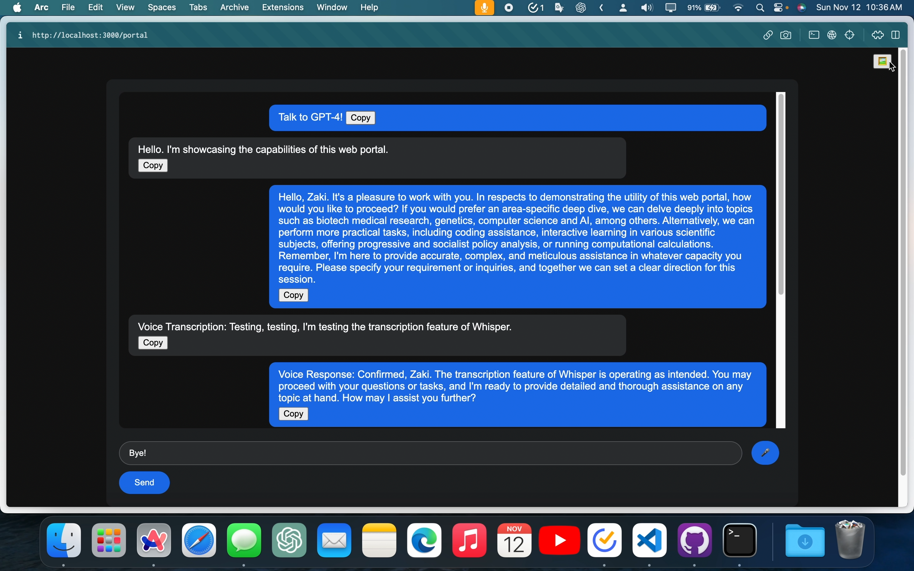
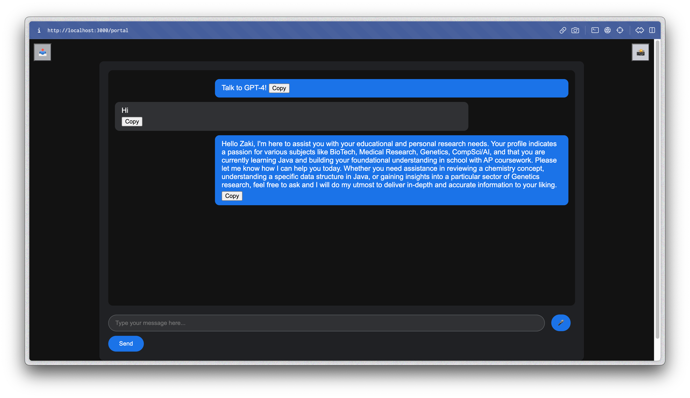
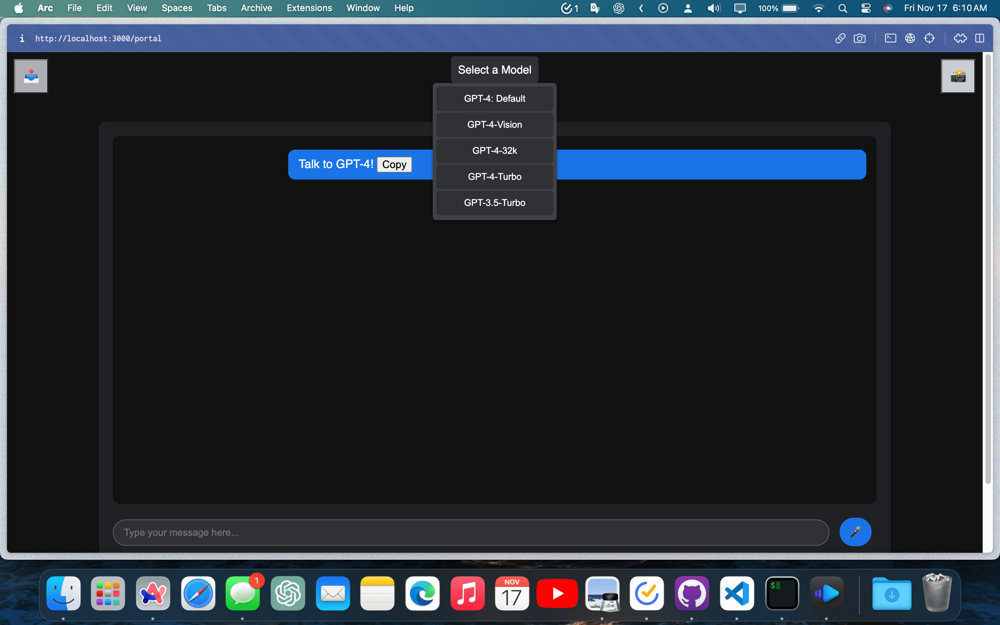

# ChatBot Portal for Multi-Modal GPT-4 API

Welcome to the **Chat-Bot Portal**, a *Node.js*-based web application that allows users to interact with a chatbot powered by *OpenAI*'s **GPT-4 API**, including the latest *Vision*, *Hearing*, and *Speaking* capabilities with superior *Model Performance*.

## Table of Contents

- [Features](#features)
- [Example](#example)
- [Structure](#structure)
- [Prerequisites](#prerequisites)
- [Installation](#installation)
- [Usage](#usage)
- [Author Notes](#author-notes)
- [Further Explanations](#further-explanations)
- [Guide: Basic Setup & Use](#guide-basic-setup--use)
- [Relevant Links](#relevant-links)
- [Author Links & Custom GPTs](#author-links--custom-gpts)
- [Research Papers](#research-papers)
- [FAQ](#faq)
- [Updates](#updates)
- [Contributions](#contributions)
- [License](#license)

## Features

- Interactive **chat interface** with support for *text messages*.
- **Voice Conversations** via *Whisper* transcriptions and *spoken responses*.
- **Image upload** functionality for *visual context* in discussions.
- Server-side integration with *OpenAI* **GPT-4 API**.
- **Basic authentication** for *secure access*.
- Customizable *System-Defined Instructions* and *Model Parameters*.
- Simple and intuitive **UI** with *copy-to-clipboard* feature for chat messages.
- **Export** as *HTML* **button** for *conversation history*.
- Integrated **shutdown** *functionality* at "**Bye!**"
- **Model Selector** of various *OpenAI APIs*. Includes:
  - GPT-4: Default – Snapshot of the Most Intelligent Version
  - GPT-4-Vision: Able to View & Analyze Images
  - GPT-4-32k: Longer Context Window – More Expensive
  - GPT-4-Turbo: Currently used in ChatGPT Plus
    - Cheaper and Longer Context, but Less Intelligent
  - GPT-3.5-Turbo: Cheapest Model

## Example



### Updated View



### Feature Demo


[**Video Showcase**](https://youtu.be/v3GVu0ZuXk4) - *Instructions*

## Structure

- **portal.html**: The main HTML file for user interaction. It includes the chat interface layout, a message input area, an image upload and export button for history, voice chat functionality, a model selector, and it links to the `script.js` file.
- **script.js**: Contains client-side logic for handling user inputs, sending messages and images to the server, and displaying responses in the chat interface. It also includes file selection for image uploads and a copy-to-clipboard function with support for exorting your current conversation history and changing models.
- **server.js**: The server-side Node.js file using Express.js. It processes POST requests to `/message`, interacts with the OpenAI GPT-4-Vision API, along with Whisper and TTS, and manages CORS, authentication, and static file serving.
- **instructions.md**: The model's System Instructions, customized for optimal responses and contextual prompt enhancement.
- **.env**: The *Environment Variable* file for your *sensitive passwords*. Must be modeled after the `.env.example` template.
- **chat.css**: The *stylesheet* for the portal's *look* and *formatting*.

## Prerequisites

- **Node.js** installed on your machine from [nodejs.org](https://nodejs.org/).
- An OpenAI **API** key for accessing *GPT-4.* Billing Credit needed.

## Installation

1. **Clone the Repository**:
   - Use *Git* to clone the repository to your local machine:

     ```sh
     git clone https://github.com/Zaki-1052/GPTPortal.git
     ```

2. **Navigate to the Project Directory**:
   - Change into the project's directory:

     ```sh
     cd GPTPortal
     ```

3. **Install Dependencies**:
   - Install the required Node.js packages:

     ```sh
     npm install
     ```

4. **Set Up Environment Variables**:
   - Create a `.env` file in the root directory.
     - Format shown in `.env.example`
   - Add your OpenAI API key and basic authentication:

     ```env
      OPENAI_API_KEY=your_api_key_here
      USER_USERNAME=Username
      USER_PASSWORD=Password
     ```

5. **Start the Server**:
   - Launch the server with Node.js:

     ```sh
     node server.js
     ```

6. **Access the Chat Interface**:
   - Open a web browser and go to `http://localhost:3000/portal`.

## Usage

- **Sending a Message**:
  - Type your message in the text box.
  - Press Enter or click the Send button to submit.
- **Starting a Voice Conversation**:
  - Click the 🎤 microphone icon to activate *voice input*.
  - Speak your query or message, and toggle the button to end recording.
  - It will be processed by the *Whisper API* and seen in the input box.
  - The model's response will be read back to you through a *text-to-speech API*.
- **Uploading an Image**:
  - Click the 📸 button to open the *file selector*.
  - Choose an image file. It will be sent with your next message.
    - **Update (~~DEPRECATED~~)**: The Default model selector is now the more intelligent GPT-4 without vision.
      - If you would like to utilize the *Vision-Preview* model, which uses GPT-4-Turbo, as in ChatGPT, please fully read this page and the documentation.
      - **UPDATE**: You can now simply choose your *preferred model* through the *drop down menu* at the top of the interface.
      - ~~Then, go to `server.js` in your preferred *Text Editor* and modify the "*model*" parameter to `gpt-4-vision-preview` as specified in the comments, which are there to guide you through the script and will be clearly marked.~~
- **Model Selector**:
  - Click on the "*Select a Model*" button at the top.
  - Hover your cursor over the options to view *descriptions*.
  - Choose your preference based on current use-case.
    - If no Model is chosen, the Portal will *Default* to the *GPT-4* snapshot.
- **Exporting Conversation**
  - Click the 📤 to export the *Conversation History*.
    - It will be an *HTML* document formatted in *Markdown*.
- Type: "**Bye!**" in the text input box in order to *end the conversation* and *kill the server*.
  - This will also *Export* the *Conversation History*.

## Author Notes

>**IMPORTANT**: *These warnings no longer apply as of commits made 11/15.*

[**~~Deprecated~~**]

- **Smartest Snapshot of ChatGPT**: This application uses the latest GPT-4 model with vision capabilities. However, users can and perhaps should switch to the standard `gpt-4` model and adjust token limits (default is 4000) for different use cases.
  - The Model Parameters, including the model itself, can be found on/around Line 200 in `server.js`, and has multiple comments to guide you if you're just getting started with customizing the API Responses.
  - Be aware that although the API returns will be objectively better than what you receive on ChatGPT, usage adds up, and you may soon run out of credits.
  - Always keep track of your token usage (relevant link found below), and adjust instructions and/or parameters when needed.
- **Voice Chat**: Calls to OpenAI's proprietary *multi-modal APIs* via your key; be sure to keep an eye on your *expenses*.
- **Billing for API Use**: A $5 deposit is required to access the *paid tier* of the OpenAI API. See OpenAI *Documentation* for billing setup.
- **Understanding GPT Parameters**: The *Basics*
  - **Temperature**: Controls randomness. Lower values make responses more predictable.
  - **Max Tokens**: Determines the length of each completion.
  - **Other Parameters**: Explore prompt engineering and comments for custom behaviors.
- **API Chat Completions**: Tailor chat completions to your specific use case.
- **Session Management**: Each page reload starts a new session. Session history isn't preserved.
- **Custom Instructions**: Found in `instructions.md`. Modify user profile and instructions as needed. These are optimized for GPT-4 based on extensive research.
- For *security reasons*, this *web portal* requires the user to do some work of their own: *installing* the necessary dependencies and packages, adding their own *environment variables* like *API Key* and *HTTP Auth Credentials* (you can simply make these up) in a `.env` file, and manually running the *server* in your terminal.
  - Be assured that this repo is incapable of grabbing any information from the User, including their Key, but they should still be careful when experimenting with *Pull Requests*, regardless of the `.gitignore` file in the root of this repository.

### Further Explanations

The OpenAI **API**, or *Application Programming Interface*, directly sends **HTTP** requests to the unsanitized and original *GPT-4 model*, and lets you customize certain weights of the model’s responses, like randomness or "temperature", and length or "tokens". You'll need to monitor your usage of the more expensive but intelligent **GPT-4** model, which will cost just over *10-20 Cents* per session, and needs you to add *Five Dollars* in credit to be able to use your **API Key**.

Be aware that at base usage of this web application, you send roughly 1000 tokens for one message to GPT-4, or three cents, and another six cents will be used when it responds with over 1000 words. This is due to the information *concatenated* to the **System Prompt** in the *Custom Instructions*. This file will be sent in the **Conversation History** with each request.

Model behavior will be primarily influenced by whatever *context* is first provided to the API; it lacks a severe filter compared to ChatGPT with increased **steerability**, but is more *expensive* than the regular Chat Interface and will *restrict* you from sending messages once you are **rate-limited**.

- Consult the provided links and **documentation** for more guidance on *Setup* and *Prompting*.
- Users are encouraged to modify the **User Profile** in `instructions.md`, which can be found in the `public` directory, as well as the model name via `server.js`, found in the root of **GPTPortal**.
- More information will be added about *Model Behavior* and *API Usage* to the **ReadMe** in the future.

**IMPORTANT Note** : For the **Voice Functionality** *Feature*, due to *WebKit's*'s lack of codec support and firewalling, *Whisper* and *TTS* will **NOT** work on the **Safari** *Browser*; you will need to switch to Chrome (or any other Chromium fork, including Edge, Opera, Brave, etc.) or Firefox if you want to use the *Voice Chat*.

If you'd like to add Apple-Support to *MediaRecording* via *JavaScript* feel free to install the [RecordRTC](https://github.com/muaz-khan/RecordRTC) GitHub repo and fork this project, as according to *Stack Overflow* and *Apple Community*, that should fix the issue, but I don't want this repository to get bloated.

- If you know of a better way, feel free to submit a **Pull Request**!
- The Relevant *Stack Overflow* Links are in this [*Arc Folder*](https://arc.net/space/04350A44-1A64-49DD-8196-FEA54DF31BDF).

Lastly, if you have uploaded an image and are working with the Vision model, you may no longer switch models mid-conversation, as it will be unable to parse the content of the image in the conversation history. It is best to export the conversation and continue it separately.

### Guide: Basic Setup & Use

#### 1. **Understanding the Basics**

- **GitHub**: A platform for *hosting and sharing code*. Think of it as a library of code projects.
- **Node.js**: An *open-source*, cross-platform *JavaScript* runtime environment. It's like the *engine* that will run the chatbot on your computer.
- **API Key**: A *unique identifier* used to authenticate requests to OpenAI's services.

#### 2. **Setting Up the Environment**

- **Create a GitHub Account**: Visit [GitHub](https://github.com/) and sign up for an account.
- **Install Git**: Download Git from [git-scm.com](https://git-scm.com/).
  - *Git* is a tool that allows you to download and manage code from GitHub.
- **Install Node.js**: Download and install Node.js from [nodejs.org](https://nodejs.org/). This will also install **npm** (*Node Package Manager*), which is used to manage JavaScript packages.

#### 3. **Cloning the Repository**

- **Clone via Git**:
- On a Mac, open '*Terminal*'; on *Windows*, open '*Command Prompt*'. These programs allow you to interact with your computer using text commands.
- Type `git clone https://github.com/Zaki-1052/GPTPortal.git` and press Enter. This command copies the ChatBot Portal code from GitHub to your computer.
- **Navigate to the Directory**:
- In the same window, type `cd GPTPortal` and press Enter. This moves you into the folder where the ChatBot Portal code is stored.
  - Be aware that in order to run the server for this repo, you will need to be in the root directory in your terminal. This means that if you rename and place it elsewhere (your Desktop, for example), you will need to `cd ~/Desktop/GPTPortal`, and use its new name before running.

#### 4. **Setting Up the ChatBot Portal**

- **Install Dependencies**:
- Still in Terminal or Command Prompt, ensure you're in the `GPTPortal` directory. Now, type `npm install` and press Enter. This installs additional code packages that the ChatBot Portal needs to function.
- **Configuration**:
- Find the `.env.example` file in the `GPTPortal` folder. Rename it to `.env`. This is where you'll put sensitive settings, like your OpenAI key.
- Open this `.env` file in a text editor and follow the format shown in the file to fill in your **OpenAI API Key** and **Login Credentials** (*Username and Password*).
  - Be sure to fill out the **HTTP Authentication** shown in the environment example as well, where you can simply make up your credentials for signing into the port. This information cannot be accessed over the internet and runs locally on your machine.

#### 5. **Obtaining an OpenAI API Key**

- **Sign Up for OpenAI**:
- Visit [OpenAI's Website](https://openai.com/) and create an account.
- **API Key Generation**:
- Once you're logged in, find the API section (linked below in *Relevant Links*) and generate a new API key. This key is like a password that lets your ChatBot Portal access OpenAI's features.
- **Insert API Key**:
- Copy the generated API key and paste it into your `.env` file in the place of `your_api_key_here`.
  - Never share your key with anyone. This is what is used to pay for the API. Their billing system is explained in the Relevant Links, but basically, you pay out of your API Credit Balance for what you actually use, and it carries over from month to month. Refer to your personal usage page for more information. Your API is private and cannot be accessed by anyone online unless you post it.

#### 6. **Running the ChatBot Portal**

- **Start the Application**:
  - Go back to *Terminal* or *Command Prompt*. Make sure you're in the `GPTPortal` directory and type `node server.js`, then press Enter. This starts the ChatBot Portal on your computer.
- **Accessing the Portal**:
- Open a web browser and type `http://localhost:3000/portal` in the address bar. Press Enter to access the ChatBot Portal.
  - You will need to sign in with the "**Username**" and "**Password**" that you chose. If you simply copied or renamed the example template, the default settings are eponymously named.

#### 7. **Basic Troubleshooting**

- **Common Issues**:
- If the ChatBot doesn't start, check if you missed any steps like installing Node.js, running `npm install`, or correctly entering your API key in the `.env` file.
- **Consult README**:
- The README file in the `GPTPortal` directory has more detailed instructions and troubleshooting tips. Refer to it if you encounter issues or need more information.

## Relevant [Links](https://arc.net/folder/B777A318-2A95-4C36-86AA-156166895CC2)

- [Pricing](https://openai.com/pricing) - OpenAI's pricing details for different API Models.
- [API Keys](https://platform.openai.com/api-keys) - Where to create and manage your OpenAI API keys.
- [Models](https://platform.openai.com/docs/models/gpt-4-and-gpt-4-turbo) - Where to view the GPT-4 model documentation.
- [Billing Activity/Usage](https://platform.openai.com/usage) - Check your usage and billing activity for OpenAI models.
  - [Account Limits](https://platform.openai.com/account/limits) - Information on billing and rate limits per tokens.
  - [Payment Balance](https://platform.openai.com/account/billing/overview) - Check and increase your API Credit and add your information.
  - [Rate Limiting](https://platform.openai.com/docs/guides/rate-limits) - Guide on rate limits for OpenAI API usage.
  - [Usage Tiers](https://platform.openai.com/docs/guides/rate-limits/usage-tiers) - Details on different usage tiers and their limits.
- [Prompt Engineering](https://platform.openai.com/docs/guides/prompt-engineering) - A guide to effective prompt engineering with OpenAI models.
- [OpenAI Tokenizer](https://platform.openai.com/tokenizer) - Visit the OpenAI Token Counter to determine message lengths.
- [Vision Documentation](https://platform.openai.com/docs/guides/vision) - OpenAI insists that the Vision model called in this API Portal is no different from the regular GPT-4, but of course, if you'd like to be sure that you're using the old version that we all miss, please change the model name as specified.

### Author Links & Custom GPTs

- [Discord](https://discord.gg/BVQd7Kdngr) - Contact me on my *Discord* server!
- [Reddit: Zaki_1052_](https://www.reddit.com/user/Zaki_1052_) - My *Reddit* account for prompts and discussions.
- [My Website](http://www.nazalibhai.com) - Visit my *custom website* for a look at *web development*.
- [NotesGPT](https://chat.openai.com/g/g-btAKVGisd-notesgpt) - *Expert at creating clear, concise, and comprehensive bullet-point notes.*
- [Summary Specialist](https://chat.openai.com/g/g-apS8hdTpI-summary-specialist) - *Expert at creating clear, concise, and comprehensive advanced summaries.*
- [Chemistry Companion](https://chat.openai.com/g/g-gDkC33NG6-chemistry-companion) - *Expert Chemistry tutor offering detailed problem-solving explanations.*
- [Calculus Companion](https://chat.openai.com/g/g-CVy3YLpLY-calculus-companion) - *Expert Calculus tutor offering detailed explanations and guided problem-solving.*
- [GrammarGPT](https://chat.openai.com/g/g-4LlLCuKZ5-grammargpt) - *Expert proofreader and grammar checker, accurate to conventional linguistic standards.*
- [LogicGPT](https://chat.openai.com/g/g-Cu2jouFyb-logicgpt) - *Expert at logical puzzles, reasoning, and thoughtful analysis. Uses CoT and ToT.*
- [PromptGPT](https://chat.openai.com/g/g-MM7wxKtTg-promptgpt) - *Expert at designing and refining AI prompts for clarity and effectiveness.*
- [StudyGuideGPT](https://chat.openai.com/g/g-Y6DEVGgvf-studyguidegpt) - *Expert at creating detailed study guide explanations for various topics.*
- [Insightful Scholar](https://chat.openai.com/g/g-MEx354Wgq-insightful-scholar) - *Highly detailed assistant for a tech-savvy high school senior with a focus on BioTech and CompSci. My Default Settings.*

### [Research Papers](https://arc.net/folder/AEE28E72-9795-42D7-9D49-D48ABA0ED00C)

Using **Chain and Tree of Thought Prompting**:

- [Chain of Thought Prompting Elicits Reasoning in Large Language Models](https://arxiv.org/pdf/2201.11903.pdf)
- [Tree of Thoughts: Deliberate Problem Solving with Large Language Models](https://arxiv.org/pdf/2305.10601.pdf)
- [Chain-of-Thought Style Prompting Increases Performance](https://arxiv.org/pdf/2305.14215v1.pdf)
- [Chain of Thought Prompting Assists LLM Reasoning](https://arxiv.org/pdf/2306.00550v1.pdf)
- [Zero-Shot CoT Prompting Aids in NLP Tasks](https://arxiv.org/pdf/2305.04091v3.pdf)
- [Reducing Hallucinations with CoT Verification](https://arxiv.org/pdf/2309.11495.pdf)
- [Google DeepMind: Attention Is All You Need](https://arxiv.org/pdf/1706.03762.pdf)
- [Reviewing Prompt Engineering in LLMs](https://arxiv.org/pdf/2310.14735.pdf)
- [CoT Reasoning Capabilities in GPTs](https://arxiv.org/pdf/2305.02897.pdf)
- [Emergent Abilities of Large Language Models](https://arxiv.org/pdf/2206.07682.pdf)
- [Enhancing LLMs with Dialog-Enabled Resolving Agents](https://arxiv.org/pdf/2303.17071.pdf)
- [GPT-4 Technical Report](https://arxiv.org/pdf/2303.08774.pdf)
- [Reflexion: Verbal Reinforcement Learning](https://arxiv.org/pdf/2303.11366.pdf)
- [Step-By-Step Verification](https://cdn.openai.com/improving-mathematical-reasoning-with-process-supervision/Lets_Verify_Step_by_Step.pdf)
- [Probabilistic Prompting Methods in NLP](https://arxiv.org/pdf/2107.13586.pdf)
- [Sparks of Artificial General Intelligence](https://arxiv.org/pdf/2303.12712.pdf)
- [Few-Shot Prompting](https://arxiv.org/pdf/2005.14165.pdf)
- [Zero-Shot Reasoning](https://arxiv.org/pdf/2205.11916.pdf)
- [Automatic CoT Prompting in LLMs](https://arxiv.org/pdf/2210.03493.pdf)
- [Self-Consistency Improvements in LLMs via CoT](https://arxiv.org/pdf/2203.11171.pdf)
- [GPT-4V System Card](https://cdn.openai.com/papers/GPTV_System_Card.pdf)
- [Optimizing Large Language Model Prompting](https://arxiv.org/pdf/2309.03409.pdf)

### FAQ

#### How do I obtain an OpenAI API key to use this portal?

To use the ChatBot Portal, you need an OpenAI API key. Register or log in to your account on [OpenAI's Website](https://openai.com/). Navigate to the API section and generate a new key. Remember to keep this key confidential, as it is used for billing purposes.

#### What are the system requirements for running this portal?

The ChatBot Portal requires Node.js, which is cross-platform and should run on most modern operating systems. Ensure your browser is up to date for the best experience. Refer to Node.js's official site for specific version requirements.

#### Can I customize the chatbot’s responses?

Yes, you can customize the chatbot's responses by adjusting the model parameters and system-defined instructions in the `server.js` and `instructions.md` files. These include settings for response length, style, and context sensitivity.

#### Is it possible to integrate this chatbot into my existing website?

Integrating this chatbot into your existing website requires some web development knowledge. You can embed the chat interface by referencing the `portal.html` in your site and ensuring that the server is correctly set up to handle requests from your domain.

#### How do I troubleshoot common issues during installation or operation?

For installation issues, ensure that all prerequisites are met and that you've followed the installation steps correctly. Common operational issues can often be resolved by checking your OpenAI API key and internet connection. For more specific problems, refer to the troubleshooting section in this README.

#### What are the costs associated with using this portal?

The costs depend on your usage of the OpenAI API. OpenAI charges based on the number of tokens processed. Monitor your usage on your OpenAI dashboard, and consider setting limits to control expenses. The API key section in this README has links to OpenAI's pricing details.

#### Is my data secure when using this chatbot portal?

Data security is a priority. However, as with any web application, ensure that you follow best practices such as using secure connections and not sharing sensitive information through the chatbot. The `.env` file ensures your API key and other sensitive data are stored securely.

### Where can I find more resources to learn about GPT-4 and API integrations?

For more in-depth knowledge about GPT-4 and API integrations, visit [OpenAI's Documentation](https://platform.openai.com) and explore the various guides and tutorials available there. Additionally, the links provided in the 'Relevant Links' section of this README offer valuable resources. Please fully read the entire page before raising an issue. Thank you!

### Updates



This **Updates** Section will showcase any further features added to the repository.

- **IMPORTANT UPDATE**: A *Model Selector* has now been added.
  - This means that you will no longer need to adjust this parameter in `server.js`.

#### Token Costs Explained

In terms of API calls, they can certainly add up if you're running heavy sessions with GPT-4: the most intelligent (and expensive!) model. For now, this section will serve as a placeholder until I add full support for tracking your token and billing credit usage; I'll also explain mathematically how you can best budget your use of these models in order to get the best possible experience!

##### Understanding the Costs and Usage Pattern

1. **Base Cost**: Each API call has a base cost of 3 cents for the system prompt (at default).
2. **Token Costs**:
   - Additional 1000 tokens in request: 3 cents.
   - Each 1000 tokens in response: 6 cents.
   - Audio adds a couple more cents (depending on length).
3. **Context Accumulation**: Using previous messages in the API request, which cumulatively increases token count.
4. **Spending**:
   - Imagine a Monthly Budget: $10.

##### Session Cost Breakdown

###### Cost Components

1. **Base Cost**: 3 cents for the system prompt (fixed 1k tokens).
2. **Input Cost**: 3 cents per 1000 tokens.
3. **Output Cost**: 6 cents per 1000 tokens.

   **Total for Initial Request**: 3 (base) + 3 (input) + 6 (output) = 12 cents.

###### Second Request

Now, let's say for the second request, you include the initial request and response as part of the input, which cumulatively increases the token count.

1. **Previous Input + Output**: 3000 tokens (2000 Input (1k System + 1k Query) + 1000 Output from the first request).
2. **New Input**: Let's assume 1000 tokens.
3. **Total Input #2**: 3000 (previous) + 1000 (new) = 4000 tokens ≈ 12 cents.
4. **Output Tokens #2**: Let's assume another 1000 tokens (6 cents).
   **Total for Second Request**: 12 (input) + 6 (output) = 18 cents.

###### Cumulative Session Cost

- **First Request**: 12 cents.
- **Second Request**: 18 cents.

   **Total Session Cost**: 12 + 18 = 30 cents.

##### Key Considerations

- **Cumulative Input**: Each subsequent request will have a larger input size due to the inclusion of previous inputs and outputs.
- **Managing Token Count**: Being strategic about the number of tokens used in each request and response can help manage costs. This includes frontloading requests with tokens or limiting the scope of each request to manage the token count.
- **Output Control**: While you have more control over the input size, the output size can vary. Planning for the maximum possible output cost in each session helps in staying within the budget.
  - These can be managed in the "*parameters*" section on `server.js` (read the comments)
- **Final Thoughts**: By understanding how the costs accumulate and the impact of including previous inputs and outputs in new requests, you can more accurately predict and manage your session costs. This step-by-step breakdown should help in visualizing how each component contributes to the total cost.

##### Monthly Budget Analysis

1. **Total Monthly Budget**: $10 (1000 cents).
2. **Daily Session Cost**: 30 cents.
3. **Monthly Session Projection**:
   - Every day for a month: 30 cents x 30 days = $9 (900 cents), which is under budget.
   - Every other day for a month: 30 cents x 15 days = $4.50 (450 cents).
     - If token use is restrained, you could have a budget of $5 per month.
     - This means that you could only use two (longer) messages in a session by alternating days.

##### Further Token Use

- If a heavier final output is needed (2000 tokens), you will reach the "*Max Tokens"* set in the parameters. While the context length of the model is 8000 tokens, 6000 is set manually here for safety.
  - This will mean an additional cost of 6 cents for 36 cents, and still need "chunking" of messages.
  - Please read OpenAI's linked *Prompt Engineering* Documentation if you expect to modify this.
- If you do expect to modify the *parameters* to use more tokens, expect that your API credit use will increase exponentially.
      - Example: A third request will mean an additional **15 cents** of input, and an output of up to an additional **20 cents** depending on the size of the response.
       - This would then total up to **70 cents** per session if audio or images are included.
       - Expect to budget the same amount as you are paying for **ChatGPT** if you are utilizing the API so heavily (*$20/month*).

#### TODOs

- [x] Add Token Cost Explanation and Tracking
- [x] Update API Call for Vision to Default Model
- [x] Add Model Selector
- [x] Make Updated Video Showcase
- [x] Added Export Functionality
- [x] Fixed Image Inputs

## Contributions

Contributions are welcome! Please fork the repository and submit a pull request with your updates.

## License

This project is open source and available under the [MIT License](LICENSE.txt).
